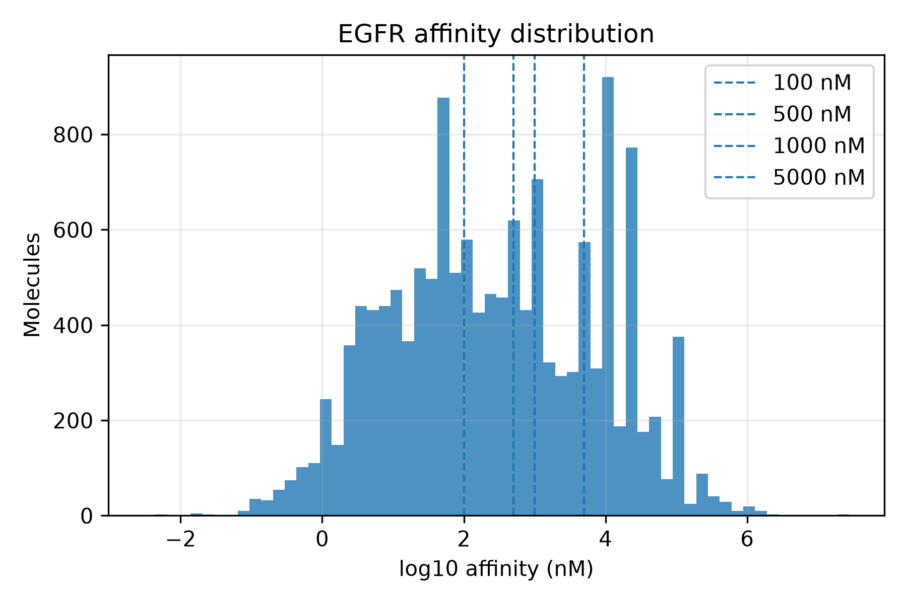

# Active Learning for Drug Discovery

A modular framework for benchmarking active learning strategies on molecular datasets from BindingDB.

The project explores how different acquisition strategies perform when the objective is to efficiently discover bioactive molecules while simultaneously improving predictive machine learning models.

Although the initial implementation focuses on binary activity prediction, the framework is designed to naturally extend to affinity regression, Bayesian uncertainty estimation, and eventually molecular optimization.

---

## Motivation

Experimental screening is expensive.

In a traditional virtual screening campaign, thousands of molecules are available, but only a small fraction can be experimentally tested.

Active learning attempts to answer a simple question:

> **Which molecule should be tested next to maximize the information gained by the model?**

Different acquisition strategies exist, but their behaviour often depends on the underlying dataset.

This repository provides a reproducible framework for comparing these strategies across multiple biological targets.

---

## Current Features

- Multi-target BindingDB preprocessing
- Automatic target preparation
- Molecular fingerprint generation (Morgan fingerprints)
- RDKit physicochemical descriptors
- Target-specific activity threshold calibration
- Active learning simulation
- Five acquisition strategies
- Multi-target benchmarking
- Automatic visualization panels
- Query-by-Committee implementation
- Reproducible experiment pipeline

---

# Framework

```
BindingDB
     │
     ▼
Target preparation
     │
     ├── Morgan fingerprints
     ├── RDKit descriptors
     ├── Metadata
     └── Activity labels
     │
     ▼
Active Learning
     │
     ├── Random
     ├── Greedy
     ├── Uncertainty Top-K
     ├── Uncertainty + Diversity
     └── Query by Committee
     │
     ▼
Benchmark
     │
     ├── ROC AUC
     ├── Active discovery
     ├── Chemical space
     └── Target comparison
```

---

# Repository Structure

```text
configs/
data/
notebooks/
results/
scripts/
src/
```

The project is divided into four components:

- preprocessing
- active learning
- visualization
- analysis

---

# Installation

```bash
git clone https://github.com/<username>/active-learning-drug-discovery.git

cd active-learning-drug-discovery

python -m venv .venv

source .venv/bin/activate

pip install -r requirements.txt
```

---

# Preparing a Target

Targets are defined in

```text
configs/targets.yaml
```

Example:

```yaml
EGFR:
    query: "Epidermal growth factor receptor"
    match: exact
    activity_threshold_nM: 500
```

Generate the processed dataset:

```bash
python scripts/prepare_target.py --target EGFR
```

This automatically creates

```text
clean.parquet
Morgan fingerprints
classification labels
physicochemical descriptors
metadata
```

---

# Inspecting Affinity Distributions

Before benchmarking a target, the affinity distribution can be inspected.

```bash
python scripts/inspect_target_affinity.py --target EGFR
```

This reports

- affinity percentiles
- candidate thresholds
- class balance
- affinity type composition

and generates an affinity distribution figure.



Target-specific thresholds make comparisons across targets substantially fairer.

---

# Running Active Learning

```bash
python scripts/run_bindingdb_repeated_simulation.py \
    --target EGFR \
    --seeds 10
```

Strategies currently implemented:

- Random
- Greedy
- Uncertainty Top-K
- Uncertainty + Diversity
- Query by Committee

---

# Classification Report

A complete visualization panel can be generated with

```bash
python scripts/plot_bindingdb_classification_panel.py \
    --target EGFR
```

Example:


The report includes

- campaign evolution
- PCA projections
- UMAP projections
- descriptor analysis
- Query-by-Committee diagnostics

---

# Multi-target Benchmark

The framework supports benchmarking across arbitrary BindingDB targets.

Current benchmark includes

- EGFR
- JAK2
- PARP1
- BRAF
- ABL1
- SRC
- VEGFR2
- CDK2
- DRD2
- CA2

Comparison panel:


---

# Main Observations

Across the targets analysed so far,

- Greedy consistently discovers the largest number of active molecules.
- Greedy also produces the weakest classifiers.
- Random sampling is a surprisingly competitive baseline after balancing class distributions.
- Query-by-Committee provides only limited improvements when committee members are highly similar.
- Uncertainty sampling combined with diversity is the most consistently strong acquisition strategy across targets.

These observations motivate the next phase of the project: affinity regression with Bayesian uncertainty estimation.

---

# Planned Features

- Affinity regression
- Bayesian active learning
- Gaussian Process models
- Deep ensemble uncertainty
- Target family comparison
- Molecular optimization
- Generative molecular design

---

# Technologies

Python

RDKit

NumPy

Pandas

Scikit-learn

Matplotlib

UMAP

PyArrow

FastParquet

---

# Reproducibility

All experiments are deterministic.

Random seeds are fixed and repeated simulations are supported for statistical robustness.

---

# Citation

If this repository contributes to your work, please consider citing it.

(BibTeX will be added after the first release.)

---

# Author

**Gian Marco Tuveri**

Computational biophysics • Bioinformatics • Machine Learning

University of Barcelona / IBEC
