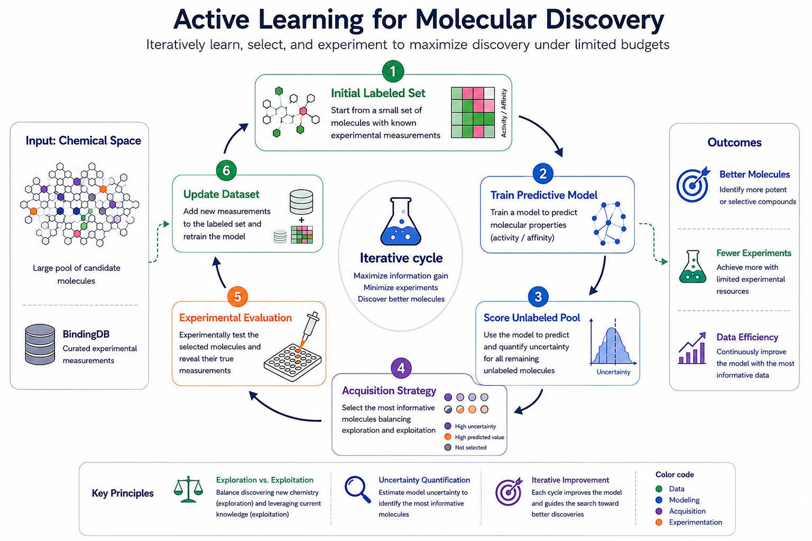
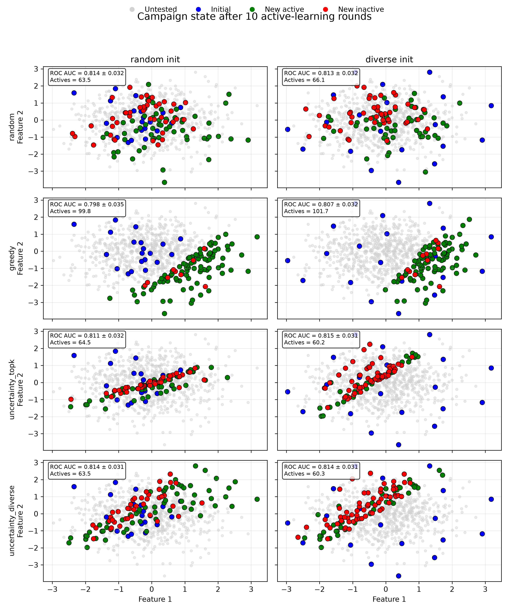
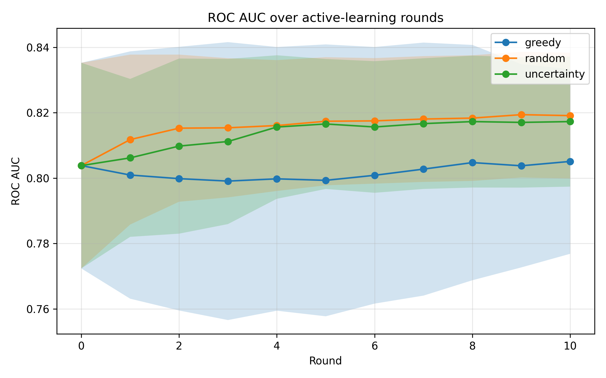
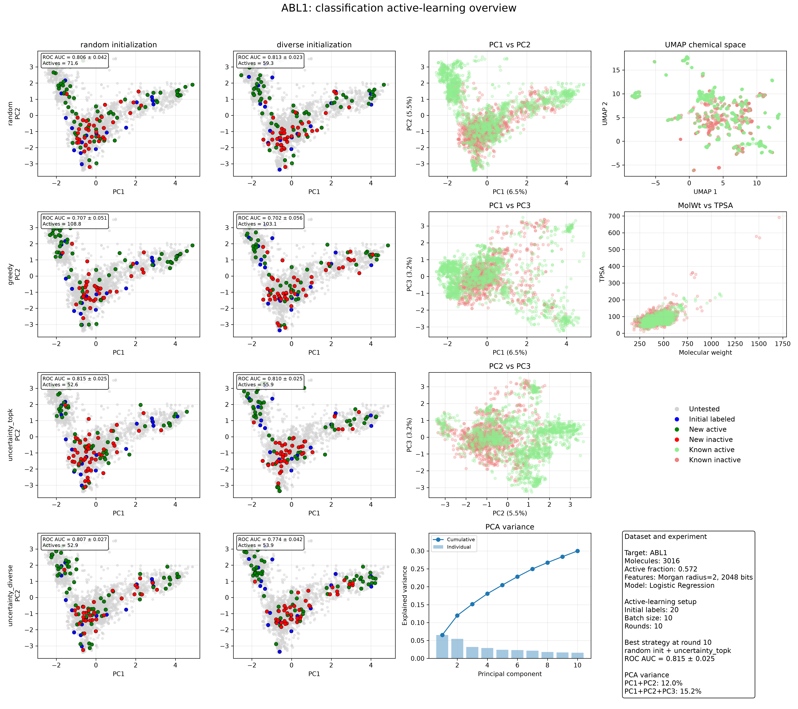
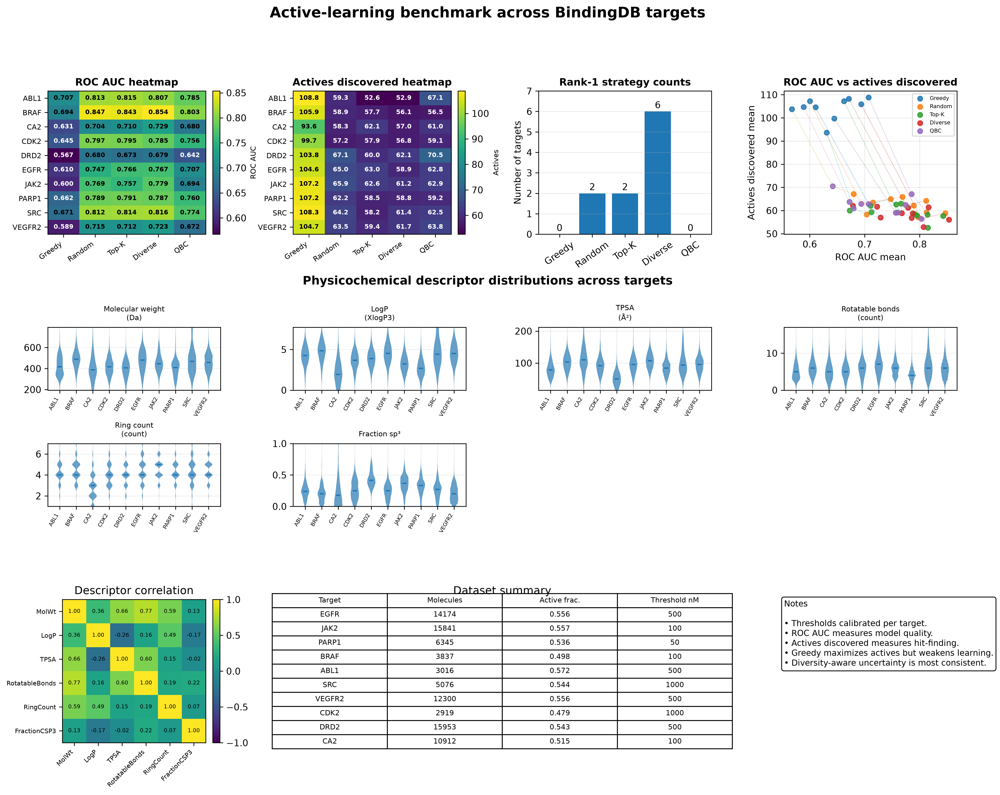
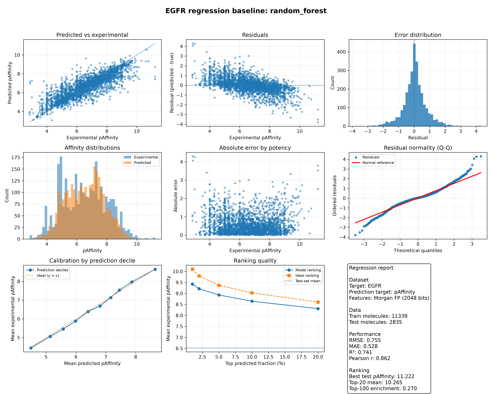
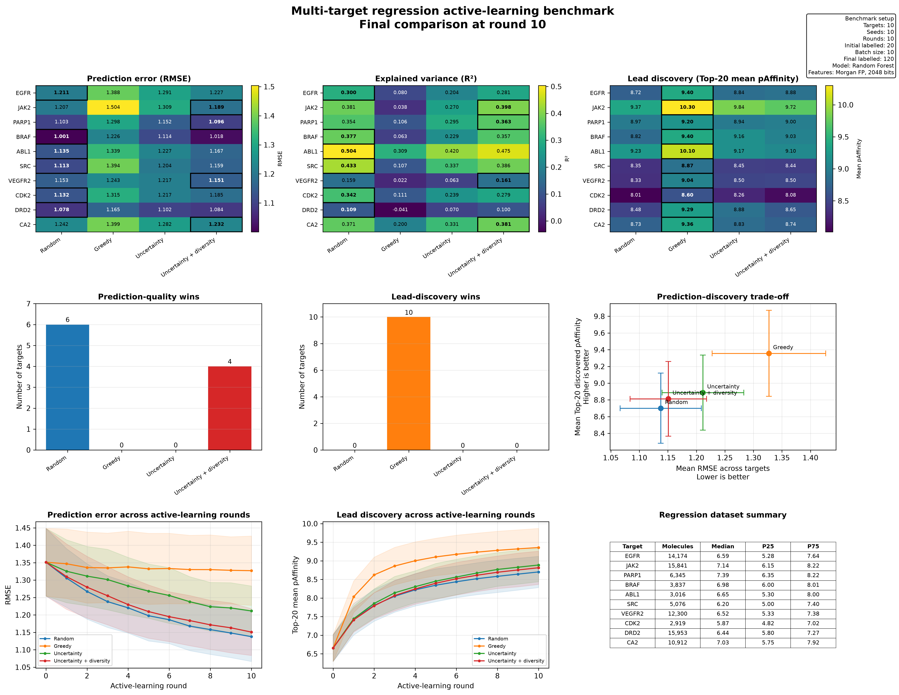

# Drug Discovery through Active Learning

> **A modular framework for studying iterative molecular discovery under constrained experimental budgets.**

---

## Overview

This repository implements a modular framework for investigating active learning in molecular discovery through retrospective simulations on curated BindingDB datasets.

Starting from binary activity classification and extending toward continuous affinity prediction, the project explores how acquisition strategies, predictive models, uncertainty estimation and molecular representations influence sequential experimental design.

Rather than presenting a single optimized pipeline, the framework has been developed incrementally. Each methodological extension addresses a limitation identified in the previous implementation, allowing new ideas to be evaluated in isolation before becoming part of the complete workflow.

Current capabilities include:

- Binary activity classification
- Continuous affinity prediction
- Multiple acquisition strategies
- Uncertainty-aware active learning
- Multi-target benchmarking
- Modular evaluation pipelines

The long-term objective is to provide a transparent and extensible framework for studying decision-making under constrained experimental budgets while progressively extending the workflow toward closed-loop molecular discovery.

---

# Motivation

Machine learning has become an important component of modern drug discovery. Predictive models are routinely used to prioritize compounds, estimate biological activity and support medicinal chemistry campaigns. Yet the limiting resource is rarely computational—it is experimental.

Every affinity measurement requires laboratory time, specialized equipment and financial investment. Consequently, only a small fraction of the accessible chemical space can ever be explored experimentally. The central challenge therefore shifts from evaluating every possible molecule to deciding **which experiments are most worth performing**.

Traditional supervised learning assumes that all experimental labels are available before model development begins. Drug discovery rarely follows this paradigm. Instead, computational models and experimental campaigns evolve together: newly acquired measurements improve the predictive model, while the updated model guides the selection of future experiments.

Active learning formalizes this iterative process by introducing acquisition strategies that determine which compounds should be experimentally characterized next.

This repository investigates that problem through a modular framework for retrospective active-learning simulations using curated BindingDB datasets.

Rather than pursuing increasingly sophisticated algorithms from the outset, the framework progresses through successive methodological extensions, each motivated by a specific scientific question. The objective is therefore not only to compare acquisition strategies, but to understand how different methodological choices influence iterative molecular discovery.

---

# Objectives

The repository provides a modular framework for investigating active learning in molecular discovery.

Current developments include:

- binary activity classification;
- continuous affinity prediction;
- uncertainty-aware acquisition;
- repeated active-learning simulations;
- multi-target benchmarking;
- modular evaluation pipelines.

The project is intended as a research framework rather than a production-ready virtual screening platform. Emphasis is placed on reproducibility, transparency and controlled methodological comparisons.

---

# Guiding principles

Development follows three complementary principles.

### Incremental development

Methodological complexity is introduced progressively.

Simple implementations establish reference behaviour before additional components are incorporated. Every extension is motivated by a limitation identified in the previous implementation, allowing individual design choices to be evaluated independently before becoming part of the complete workflow.

### Validation-driven development

Architectural refactoring and methodological extensions are systematically validated before serving as the basis for further development.

Synthetic benchmarks, repeated simulations and behavioural equivalence tests ensure that observed performance differences originate from scientific modifications rather than implementation artefacts.

### Modular architecture

The workflow separates molecular representations, predictive models, acquisition strategies, simulation engines and evaluation metrics into independent modules.

This organization allows individual components to evolve without redesigning the overall framework, facilitating reproducibility and future methodological extensions.

---

# Data source

The framework relies on experimentally measured protein–ligand interactions extracted from **BindingDB**.

Its combination of experimentally determined affinities, diverse therapeutic targets and publicly available annotations makes it particularly suitable for retrospective active-learning studies.

The datasets used throughout this repository originate from a dedicated curation pipeline developed separately from this project. That workflow standardizes molecular representations, resolves inconsistent affinity measurements and produces reproducible target-specific datasets suitable for machine-learning experiments.

Keeping data curation independent from methodological development allows both projects to evolve separately while maintaining reproducibility.

---

# Retrospective active-learning simulations

Prospective active-learning campaigns require iterative laboratory experiments and are therefore costly and time consuming.

The framework instead adopts retrospective simulations, where experimentally measured affinities are already available but are progressively revealed following the selected acquisition strategy.

Although retrospective simulations cannot replace prospective validation, they provide a controlled environment in which different acquisition strategies can be compared under identical experimental conditions, eliminating variability introduced by independent laboratory campaigns.

---

# Workflow

The framework reproduces the iterative process underlying an active-learning campaign.

**Figure – Workflow overview**


Starting from an initial labelled dataset, a predictive model is trained and used to score the remaining candidate compounds.

An acquisition strategy then selects the next batch of molecules for experimental evaluation. The newly acquired measurements are incorporated into the training dataset, the model is retrained, and the cycle repeats until the experimental budget is exhausted.

This modular organization allows molecular representations, predictive models and acquisition strategies to be combined interchangeably while preserving a common simulation workflow.

---

# Classification framework

Binary activity prediction provides the initial environment used to investigate acquisition strategies.

Although continuous affinity prediction more closely reflects medicinal chemistry, classification isolates the behaviour of different acquisition policies before introducing additional modelling complexity.

The current framework includes:

- Random acquisition
- Greedy acquisition
- Uncertainty sampling
- Diversity-aware uncertainty
- Query by Committee

These strategies span different exploration–exploitation trade-offs while remaining sufficiently simple to analyse in controlled settings.

## Synthetic benchmarks

Acquisition strategies are first evaluated on synthetic datasets whose geometry is completely known.

This controlled environment makes it possible to attribute observed behaviour directly to the acquisition strategy itself before transferring the methodology to realistic molecular datasets.

**Figure – Toy acquisition benchmark**



The synthetic benchmark highlights clear differences in exploration behaviour among acquisition strategies despite relatively small differences in predictive performance after multiple acquisition rounds.

**Key observation**

Active-learning strategies differ primarily in the information they acquire rather than in the predictive performance ultimately achieved by the classifier.

---

## Molecular benchmarks

The same acquisition strategies are subsequently evaluated on curated BindingDB targets.

**Figure – ABL1 benchmark**


Real molecular datasets introduce substantially greater complexity than synthetic benchmarks. Molecular fingerprints provide only a partial representation of chemical space, while experimentally measured affinities introduce additional variability.

Nevertheless, acquisition strategies continue to generate distinct exploration patterns that closely resemble those observed in synthetic datasets.

Extending the analysis across multiple therapeutic targets demonstrates that no acquisition strategy consistently dominates every evaluation criterion.

**Figure – Multi-target classification benchmark**


Greedy acquisition generally retrieves the largest number of active compounds, whereas diversity-aware uncertainty provides a more balanced compromise between predictive performance and exploration.

**Key observation**

Different acquisition strategies optimize different scientific objectives. Their suitability therefore depends on the experimental question rather than on a single evaluation metric.

---

# Regression framework

Binary classification inevitably discards information contained in experimental affinity measurements.

The regression framework extends the methodology toward continuous affinity prediction while preserving the modular active-learning architecture established for classification.

Current developments include:

- continuous affinity prediction;
- uncertainty-aware acquisition;
- Upper Confidence Bound optimization;
- repeated simulations;
- target-wise benchmarking.

**Figure – EGFR regression diagnostics**


Rather than relying on a single performance metric, regression models are evaluated through complementary analyses including residual behaviour, ranking performance, calibration and affinity enrichment.

These diagnostics establish the predictive reliability required before integrating uncertainty into acquisition strategies.

**Figure – Multi-target regression benchmark**


Across multiple protein targets, regression highlights a clearer trade-off between predictive performance and lead discovery than classification.

Rather than treating exploration and exploitation as independent acquisition strategies, uncertainty naturally becomes part of the acquisition score itself.

**Key observation**

Continuous affinity prediction transforms active learning from a classification problem into a sequential optimization problem.

---

# Evaluation philosophy

Active learning cannot be evaluated through predictive accuracy alone.

Two acquisition strategies may produce classifiers with comparable predictive performance while selecting fundamentally different compounds throughout the campaign.

The framework therefore evaluates active-learning experiments using multiple complementary perspectives, including predictive performance, lead retrieval, ranking quality and acquisition behaviour.

Whenever possible, experiments are repeated across multiple random seeds and multiple protein targets to distinguish methodological trends from target-specific observations.

---

# Repository structure

```text
drug-discovery-active-learning/

├── src/
│   ├── classification/
│   ├── regression/
│   ├── acquisition/
│   ├── evaluation/
│   ├── simulation/
│   └── utils/
│
├── scripts/
├── notebooks/
├── results/
└── README.md
```

---

# Installation

Clone the repository:

```bash
git clone https://github.com/gianMtuveri/drug-discovery-active-learning.git
cd drug-discovery-active-learning
```

Create a virtual environment:

```bash
python -m venv .venv
source .venv/bin/activate
```

Install the project:

```bash
pip install -e .
```

Install additional dependencies if required:

```bash
pip install -r requirements.txt
```

---

# Quick start

## Classification workflow

```bash
python scripts/classification/run_bindingdb_repeated_simulation.py \
    --target EGFR \
    --strategy uncertainty_diverse \
    --seeds 10
```

Typical workflow:

1. Load a curated BindingDB dataset.
2. Select an initialization strategy.
3. Train the predictive model.
4. Execute an active-learning campaign.
5. Evaluate acquisition performance.

---

## Regression workflow

```bash
python scripts/regression/run_bindingdb_repeated_simulation.py \
    --target EGFR \
    --strategy ucb \
    --beta 2.0 \
    --seeds 10
```

Typical workflow:

1. Load a curated affinity dataset.
2. Train the regression model.
3. Estimate predictive uncertainty.
4. Execute an uncertainty-aware acquisition campaign.
5. Evaluate predictive and acquisition performance.

---

# Roadmap

Current developments focus on extending the framework along four complementary directions.

### Predictive models

- richer molecular representations;
- graph neural networks;
- uncertainty calibration.

### Acquisition strategies

- adaptive exploration–exploitation balancing;
- convergence-aware stopping criteria;
- calibration-aware acquisition.

### Simulation

- prospective active-learning campaigns;
- simulated assay variability;
- adaptive experimental budgets.

### Molecular discovery

- molecular generation for low-data targets;
- iterative molecular optimization;
- closed-loop discovery workflows.

---

# References

1. Reker D. *Practical considerations for active machine learning in drug discovery.*

2. Wang Y. *The present state and challenges of active learning in drug discovery.*

3. Masood K. *Molecular property prediction using pretrained BERT and Bayesian active learning.*
